# **Введение**
В настоящее время существует много стоматологических клиник, которые имеют затруднения в учете записей на прием. Для пациента основной проблемой может оказаться неясность в расписании или потеря времени при записи, для стоматолога - поиск данных о пациентах вручную, который снижает эффективность работы и увеличивает вероятность ошибок. Также стоматологические клиники могут иметь трудности с формированием отчета с указанием фиксированных диагнозов, проведенных процедур в ходе приема.

Разработка специализированного программного обеспечения для автоматизации рутинных процессов стоматологической клиники актуальна, так как способна повысить эффективность работы стоматологической клиники – программа ускорит учет пациентов, врачей и записей на прием, а также формирование медицинских отчетов, что важно при большом количестве ранее упомянутых параметров.

**Цель курсового проекта**: автоматизировать рутинные процессы работы стоматологической клиники за счет разработки приложения «Стоматологическая клиника» с графическим интерфейсом на языке Java, демонстрирующее упрощение работы стоматологической клиники за счет.

**Задачи:**

1. **Разработка функциональности "Стоматологическая клиника":**
- Ведение общего списка пациентов, врачей, записей на прием:
  - Хранение данных о пациентах, врачах, записях на прием в базе данных PostgreSQL;
  - Создание, редактирование и удаление данных о пациентах, врачах, записях на прием.
- Работа с медицинскими отчетами:
  - Автоматическое формирование медицинских отчетов на основе списков пациентов, врачей, записей на прием;
  - Экспорт протокола в формате .txt.
1. **Тестирование и отладка приложения:**
- Провести ручное тестирование приложения, убедиться в корректной работе всех функций;
- Исправить найденные ошибки и недоработки.

#  **1 Анализ предметной области и постановка задачи**

  **Контекст проблемы:** В настоящее время стоматологические клиники сталкиваются с необходимостью эффективного управления пациентами, врачами и записями на прием. В клинике работают врачи различных специализаций, которые оказывают различные виды стоматологических услуг. Пациенты обращаются в клинику с разными проблемами, имеют различную историю болезней, хронические заболевания и аллергии, которые необходимо учитывать при лечении. Записи на прием должны учитывать специализацию врача, тип процедуры, доступное время и статус приема. При большом потоке пациентов и разнообразии оказываемых услуг, ручное управление этими процессами становится неэффективным и подверженным ошибкам.

  **Проблема:** Стоматологическая клиника сталкивается с необходимостью:

1. Ведения учета пациентов с их медицинской историей.
1. Управления штатом врачей с учетом их специализаций и квалификации.
1. Организации записей на прием с учетом:
- Специализации врача и типа процедуры.
- Доступного времени врача.
- Медицинских противопоказаний пациента.
- Статуса приема (запланирован, выполнен, отменен).
1. Формирования отчетности по работе клиники.

**Функциональные требования:**

1. **Управление данными пациентов**
- **Хранение информации о пациентах:**
  - ФИО.
  - Дата рождения.
  - Контактные данные (телефон, адрес).
  - Текущее заболевание.
  - Хронические заболевания.
  - Аллергии.
  - Предыдущие заболевания.
  - Наследственные заболевания.
- **Операции с пациентами:**
  - Регистрация нового пациента.
  - Редактирование данных пациента.
  - Удаление пациента из системы.
  - Просмотр полной медицинской истории.
1. **Управление данными врачей**
- **Хранение информации о врачах:**
  - ФИО.
  - Специализация (стоматолог-терапевт, хирург, ортодонт и т.д.)
  - Контактные данные (телефон, email).
- **Операции с врачами:**
  - Добавление нового врача.
  - Редактирование данных врача.
  - Удаление врача из системы.
  - Просмотр расписания врача.
1. **Управление записями на прием**
- **Создание и управление записями:**
  - **Создание новой записи с выбором:**
    - Пациента.
    - Врача (с учетом специализации).
    - Даты и времени приема.
    - Типа процедуры.
  - Редактирование записи.
  - Отмена записи.
  - Изменение статуса записи (запланирован, выполнен, отменен).
  - **Фильтрация записей:**
    - По пациенту.
    - По врачу.
    - По дате.
    - По типу процедуры.
    - По статусу.
1. **Формирование отчетности**
- **Генерация отчетов:**
  - По врачам.
  - По пациентам.
  - По записям на прием.
- **Экспорт отчетов:**
  - В формате TXT.
  - Возможность выбора периода, конкретного врача/пациента для отчета.
1. **Валидация данных**
- **Проверка корректности вводимых данных:**
  - Обязательные поля.
  - Формат даты и времени.
  - Формат телефонных номеров.
  - Формат email.
- **Проверка бизнес-правил:**
  - Проверка доступности врача в выбранное время.
  - Проверка соответствия специализации врача типу процедуры.
  - Проверка медицинских противопоказаний пациента.
1. **Поиск и фильтрация**
- **Гибкие фильтры для всех сущностей:**
  - Поиск пациентов по ФИО, телефону.
  - Поиск врачей по ФИО, специализации.
  - Поиск записей по различным параметрам.
- **Сортировка данных:**
  - По дате.
  - По ФИО.
  - По статусу.
  - По типу процедуры.
1. **Интерфейс пользователя**
- **Главное окно с вкладками:**
  - Пациенты.
  - Врачи.
  - Записи на прием.
  - Отчеты.
- **Диалоговые окна для:**
  - Добавления/редактирования данных.
  - Фильтрации.
  - Формирования отчетов.
- **Таблицы с возможностью:**
  - Сортировки.
  - Фильтрации.
  - Редактирования.
  - Удаления записей.
1. **Обработка ошибок**
- **Обработка и отображение ошибок:**
  - Ошибки валидации данных.
  - Ошибки доступа к базе данных.
  - Ошибки бизнес-логики.
  - Логирование ошибок для последующего анализа.
1. **Безопасность**
- **Защита данных:**
  - Валидация вводимых данных.
  - Проверка прав доступа.
  - Защита от SQL-инъекций.
  - Резервное копирование данных.
1. **Интеграция с базой данных**
- **Работа с PostgreSQL:**
  - Создание и обновление записей.
  - Выполнение сложных запросов.
  - Транзакционность операций.
  - Оптимизация запросов для быстрой работы с большими объемами данных.
# 

#  2 Проектирование базы данных
# 

В ходе разработки приложения "Стоматологическая клиника" для автоматизации рутинных процессов работы стоматологи была реализована база данных на PostgreSQL. Описание таблиц БД представлено в таблице 1.1.

Таблица 1.1 – Описание таблиц БД

<table><tr><th colspan="1"><b>Имя таблицы</b></th><th colspan="1"><b>Имя атрибута</b></th><th colspan="1"><b>Тип</b></th><th colspan="1"><b>Размер</b></th><th colspan="1"><b>Описание</b></th></tr>
<tr><td colspan="1" rowspan="12">patients</td><td colspan="1">id</td><td colspan="1">INTEGER</td><td colspan="1">4 байта</td><td colspan="1">
Идентификатор пациента

Ключевое поле
</td></tr>
<tr><td colspan="1">last_name</td><td colspan="1">VARCHAR</td><td colspan="1">50 байт</td><td colspan="1">Фамилия пациента</td></tr>
<tr><td colspan="1">first_name</td><td colspan="1">VARCHAR</td><td colspan="1">50 байт</td><td colspan="1">Имя пациента</td></tr>
<tr><td colspan="1">middle_name</td><td colspan="1">VARCHAR</td><td colspan="1">50 байт</td><td colspan="1">Отчество пациента</td></tr>
<tr><td colspan="1">date_of_birth</td><td colspan="1">DATE</td><td colspan="1">4 байта</td><td colspan="1">Дата рождения пациента</td></tr>
<tr><td colspan="1">phone_number</td><td colspan="1">VARCHAR</td><td colspan="1">15 байт</td><td colspan="1">Номер телефона пациента</td></tr>
<tr><td colspan="1">address</td><td colspan="1">VARCHAR</td><td colspan="1">200 байт</td><td colspan="1">Адрес проживания пациента</td></tr>
<tr><td colspan="1">disease</td><td colspan="1">VARCHAR</td><td colspan="1">200 байт</td><td colspan="1">Текущее заболевание пациента</td></tr>
<tr><td colspan="1">chronic_diseases</td><td colspan="1">TEXT</td><td colspan="1">255 байт</td><td colspan="1">Хронические заболевания пациента</td></tr>
<tr><td colspan="1">allergies</td><td colspan="1">TEXT</td><td colspan="1">255 байт</td><td colspan="1">Аллергии пациента</td></tr>
<tr><td colspan="1">previous_diseases</td><td colspan="1">TEXT</td><td colspan="1">255 байт</td><td colspan="1">Предыдущие заболевания пациента</td></tr>
<tr><td colspan="1">hereditary_diseases</td><td colspan="1">TEXT</td><td colspan="1">255 байт</td><td colspan="1">Наследственные заболевания пациента</td></tr>
<tr><td colspan="1" rowspan="6">doctors</td><td colspan="1">id</td><td colspan="1">INTEGER</td><td colspan="1">4 байта</td><td colspan="1">
Идентификатор стоматолога

Ключевое поле
</td></tr>
<tr><td colspan="1">last_name</td><td colspan="1">VARCHAR</td><td colspan="1">50 байт</td><td colspan="1">Фамилия стоматолога</td></tr>
<tr><td colspan="1">first_name</td><td colspan="1">VARCHAR</td><td colspan="1">50 байт</td><td colspan="1">Имя стоматолога</td></tr>
<tr><td colspan="1">middle_name</td><td colspan="1">VARCHAR</td><td colspan="1">50 байт</td><td colspan="1">Отчество стоматолога</td></tr>
<tr><td colspan="1">specialization</td><td colspan="1">VARCHAR</td><td colspan="1">100 байт</td><td colspan="1">Специализация стоматолога</td></tr>
<tr><td colspan="1">phone_number</td><td colspan="1">VARCHAR</td><td colspan="1">15 байт</td><td colspan="1">Номер телефона врача</td></tr>
</table>

Продолжение таблицы 1.1 – Описание таблиц БД

<table><tr><th colspan="1">doctors</th><th colspan="1">email</th><th colspan="1">VARCHAR</th><th colspan="1">15 байт</th><th colspan="1">Email врача</th></tr>
<tr><td colspan="1" rowspan="9">appointments </td><td colspan="1">id</td><td colspan="1">INTEGER</td><td colspan="1">4 байта</td><td colspan="1">
Идентификатор записи

Ключевое поле
</td></tr>
<tr><td colspan="1">appointment_date_time</td><td colspan="1">TIMESTAMP</td><td colspan="1">8 байт</td><td colspan="1">Дата и время приема</td></tr>
<tr><td colspan="1">procedure_type</td><td colspan="1">VARCHAR</td><td colspan="1">200 байт</td><td colspan="1">Тип процедуры</td></tr>
<tr><td colspan="1">status</td><td colspan="1">VARCHAR</td><td colspan="1">20 байт</td><td colspan="1">Статус записи</td></tr>
<tr><td colspan="1">patient_id</td><td colspan="1">INTEGER</td><td colspan="1">4 байта</td><td colspan="1">
Идентификатор пациента

Внешнее поле
</td></tr>
<tr><td colspan="1">doctor_id</td><td colspan="1">INTEGER</td><td colspan="1">4 байта</td><td colspan="1">
Идентификатор стоматолога

Внешнее поле
</td></tr>
<tr><td colspan="1">diagnosis</td><td colspan="1">VARCHAR</td><td colspan="1">500 байт</td><td colspan="1">Диагноз</td></tr>
<tr><td colspan="1">procedures_performed</td><td colspan="1">TEXT</td><td colspan="1">255 байт</td><td colspan="1">Выполненные процедуры</td></tr>
<tr><td colspan="1">notes</td><td colspan="1">TEXT</td><td colspan="1">255 байт</td><td colspan="1">Примечания врача</td></tr>
</table>

На рисунке 2.1 представлена диаграмма таблиц базы данных.

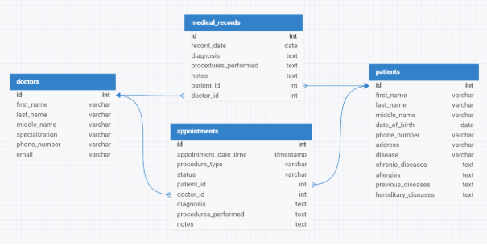

Рисунок 2.1 – Диаграмма таблиц БД

**SQL-запросы к БД:**

Класс PatientRepository:

1. Получение всех пациентов:

   SELECT id, first\_name, last\_name, middle\_name, date\_of\_birth, phone\_number, address, 

   `       `disease, chronic\_diseases, allergies, previous\_diseases, hereditary\_diseases 

   FROM patients

1. Получение пациента по ID:

   SELECT id, first\_name, last\_name, middle\_name, date\_of\_birth, phone\_number, address, 

   `       `disease, chronic\_diseases, allergies, previous\_diseases, hereditary\_diseases 

   FROM patients 

   WHERE id = ?

1. Добавление нового пациента:

   INSERT INTO patients (first\_name, last\_name, middle\_name, date\_of\_birth, phone\_number, address, 

   `                     `disease, chronic\_diseases, allergies, previous\_diseases, hereditary\_diseases) 

   VALUES (?, ?, ?, ?, ?, ?, ?, ?, ?, ?, ?) 

   RETURNING id

1. Удаление пациента:

   DELETE FROM patients 

   WHERE id = ?

1. Поиск пациента по телефону:

   SELECT id, first\_name, last\_name, middle\_name, date\_of\_birth, phone\_number, address, 

   `       `disease, chronic\_diseases, allergies, previous\_diseases, hereditary\_diseases 

   FROM patients 

   WHERE phone\_number = ?

   Класс DoctorRepository:

1. Получение всех врачей:

   SELECT id, first\_name, last\_name, middle\_name, specialization, phone\_number, email 

   FROM doctors

1. Получение врача по ID:

   SELECT id, first\_name, last\_name, middle\_name, specialization, phone\_number, email 

   FROM doctors 

   WHERE id = ?

1. Поиск врача по email:

   SELECT id, first\_name, last\_name, middle\_name, specialization, phone\_number, email 

   FROM doctors 

   WHERE email = ?

1. Добавление нового врача:

   INSERT INTO doctors (first\_name, last\_name, middle\_name, specialization, phone\_number, email) 

   VALUES (?, ?, ?, ?, ?, ?) 

   RETURNING id

1. Удаление врача:

   DELETE FROM doctors 

   WHERE id = ?

   Класс AppointmentRepository:

1. Получение всех записей на прием:

   SELECT id, appointment\_date\_time, procedure\_type, status, patient\_id, doctor\_id, 

   `       `diagnosis, procedures\_performed, notes 

   FROM appointments

1. Получение записи на прием по ID:

   SELECT id, appointment\_date\_time, procedure\_type, status, patient\_id, doctor\_id, 

   `       `diagnosis, procedures\_performed, notes 

   FROM appointments 

   WHERE id = ?

1. Добавление новой записи на прием:

   INSERT INTO appointments (appointment\_date\_time, procedure\_type, status, patient\_id, doctor\_id, 

   `                         `diagnosis, procedures\_performed, notes) 

   VALUES (?, ?, ?, ?, ?, ?, ?, ?) 

   RETURNING id

1. Удаление записи на прием:

   DELETE FROM appointments 

   WHERE id = ?

1. Поиск записей на прием по врачу и дате:

   SELECT \* FROM appointments 

   WHERE doctor\_id = ? AND DATE(appointment\_date\_time) = DATE(?)
   **\

   **3 Проектирование графического интерфейса**

   Графический интерфейс программы будет состоять из нескольких панелей. Панель управления пациентами встречает пользователя и предлагает главный функционал программы: работа с данными пациентов, врачей и записей на прием и создание отчетов с применением фильтров. Информационная архитектура приложения и легенда к ней представлены на рисунке 3. 

47

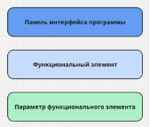

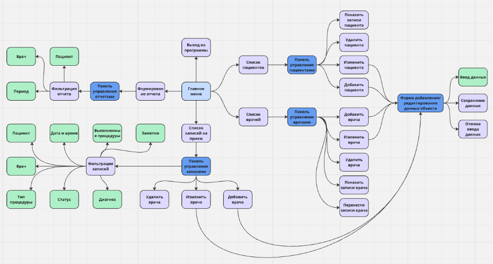

Рисунок 3.1 – Информационная архитектура 

Ниже представлены макеты графических интерфейсов каждого панели.

Описание: 

**Панель управления пациентами**

1\. Верхняя часть. В верхней части окна расположен компонент с вкладками (JTabbedPane), содержащий четыре вкладки: 

- Пациенты.
- Врачи.
- Записи на прием.
- Отчеты.

  2\. Центральная часть. Под вкладками размещена таблица (JTable), отображающая список пациентов с колонками: 

- Фамилия.
- Имя.
- Отчество.
- Дата рождения.
- Телефон.
- Заболевание.

  3\. Нижняя часть. Внизу под таблицей находится панель с тремя кнопками, расположенными горизонтально: 

- Добавить - для добавления новой записи пациента.
- Редактировать - для редактирования выбранной записи.
- Удалить - для удаления выбранной записи.

  На рисунке 3.2 изображен графический интерфейс панели управления пациентами.

  

  Рисунок 3.2 - Графический интерфейс панели управления пациентами.

  Описание:

  Панель управления врачами

  1\. Верхняя часть. В верхней части окна расположен компонент с вкладками (JTabbedPane), содержащий четыре вкладки: 

- Пациенты.
- Врачи.
- Записи на прием.
- Отчеты.

  2\. Центральная часть. Под вкладками размещена таблица (JTable), отображающая список пациентов с колонками: 

- Фамилия.
- Имя.
- Отчество.
- Специализация.
- Телефон.
- Email.

  3\. Нижняя часть. Внизу под таблицей находится панель с тремя кнопками, расположенными горизонтально: 

- Добавить - для добавления новой записи пациента.
- Редактировать - для редактирования выбранной записи.
- Удалить - для удаления выбранной записи.
- Перенести записи – для смещения дат записей на определенное количество дней.

  На рисунке 3.3 изображен графический интерфейс панели управления врачами.

  ![ref1]

  Рисунок 3.3 - Графический интерфейс панели управления врачами

  **Панель управления записями**

  1\. Верхняя часть. В верхней части окна расположен компонент с вкладками (JTabbedPane), содержащий четыре вкладки: 

- Пациенты.
- Врачи.
- Записи на прием.
- Отчеты.

  2\. Центральная часть. Под вкладками размещена таблица (JTable), отображающая список пациентов с колонками: 

- Дата и время.
- Пациент.
- Врач.
- Тип процедуры.
- Статус.
- Диагноз.
- Выполненные процедуры.
- Заметки.

  3\. Нижняя часть. Внизу под таблицей находится панель с тремя кнопками, расположенными горизонтально: 

- Добавить - для добавления новой записи пациента.
- Редактировать - для редактирования выбранной записи.
- Удалить - для удаления выбранной записи.
- Фильтр - для фильтрации записи по определенным параметрам.

  На рисунке 3.4 изображен графический интерфейс панели управления записями на прием.

  ![ref1]

  Рисунок 3.4 - Графический интерфейс панели управления записями на прием

  **Панель управления записями c включенной фильтрацией**

  Верхняя часть - Фильтры 

  В верхней части расположена панель с фильтрами для отбора данных. 

  Слева размещены метки (JLabel): 

  - Метка для периода (Период:) с двумя полями ввода даты/времени (JFormattedTextField), разделёнными дефисом. 

  - Метка для выбора пациента (Пациент:) и соответствующий выпадающий список (JComboBox). 

  - Метка для выбора врача (Врач:) и выпадающий список. 

  - Метка для выбора типа процедуры (Тип процедуры:) и выпадающий список. 

  Под фильтрами расположены две кнопки: 

  - Применить фильтры.

  - Сбросить фильтры.

  На рисунке 3.5 изображен графический интерфейс панели управления записями на прием c включенной фильтрацией.

  

  Рисунок 3.5 - Графический интерфейс панели управления записями на прием c включенной фильтрацией

  **Панель управления отчетами**

  1\. Верхняя область - Параметры отчета: 

  Слева направо расположены следующие компоненты: 

  - Метка "Период:" (JLabel) и два текстовых поля (JFormattedTextField) для ввода дат (начало и конец периода отчёта). 

  - Метка "Врач:" (JLabel) и выпадающий список (JComboBox) для выбора врача. 

  - Метка "Пациент:" (JLabel) и выпадающий список (JComboBox) для выбора пациента.

  2\. Центральная область - Область вывода отчёта:

  Под панелью параметров расположен текстовый компонент (JTextArea), предназначенный для отображения сгенерированного отчёта. 

  3\. Нижняя область - кнопки управления отчетами:

  В нижней части вкладки расположены две кнопки (JButton): 

  - "Сохранить в файл..." - кнопка для сохранения сгенерированного отчёта в файл. 

  - "Сгенерировать отчет" - кнопка для запуска процесса генерации отчёта на основе выбранных параметров.

  На рисунке 3.6 изображен графический интерфейс панели управления отчетами.

  

  Рисунок 3.6 - Графический интерфейс панели управления отчетами

  **Диалоговое окно добавления/редактирования пациента:**

  1\. Форма ввода данных пациента 

  Диалог содержит несколько полей для ввода информации, расположенных вертикально с метками (JLabel) слева и полями (JTextField) справа: 

  - Фамилия: Текстовое поле для ввода фамилии пациента. 

  - Имя: Текстовое поле для ввода имени пациента. 

  - Отчество: Текстовое поле для ввода отчества пациента. 

  - Дата рождения: Текстовое поле для ввода даты рождения. 

  - Телефон: Текстовое поле для ввода телефонного номера.

  - Заболевание: Выпадающий список (JComboBox) с перечнем заболеваний.

  3\. Кнопки управления 

  Внизу диалогового окна расположены две кнопки (JButton), расположенные горизонтально и сдвинутые к центру: 

  - Подтвердить - для сохранения введённых данных и закрытия диалога. 

  - Отмена - для закрытия окна без сохранения изменений.

  На рисунке 3.7 изображен графический интерфейс окна добавления/редактирования пациента.

  ![ref2]

  Рисунок 3.7 - Графический интерфейс окна добавления/редактирования пациента

  **Диалоговое окно добавления/редактирования врача:**

  1\. Форма ввода данных пациента 

  Диалог содержит несколько полей для ввода информации, расположенных вертикально с метками (JLabel) слева и полями (JTextField) справа: 

  - Фамилия: Текстовое поле для ввода фамилии пациента. 

  - Имя: Текстовое поле для ввода имени пациента. 

  - Отчество: Текстовое поле для ввода отчества пациента. 

  - Специализация: Выпадающий список (JComboBox) с перечнем специализаций. 

  - Телефон: Текстовое поле для ввода телефонного номера.

  - Email: Текстовое поле для ввода электронного почтового ящика.

  3\. Кнопки управления 

  Внизу диалогового окна расположены две кнопки (JButton), расположенные горизонтально и сдвинутые к центру: 

  - Подтвердить - для сохранения введённых данных и закрытия диалога. 

  - Отмена - для закрытия окна без сохранения изменений.

  На рисунке 3.8 изображен графический интерфейс окна добавления/редактирования пациента.

  ![ref2]

  Рисунок 3.8 - Графический интерфейс окна добавления/редактирования пациента

  **Диалоговое окно добавления/редактирования врача:**

  1\. Форма ввода данных пациента 

  Диалог содержит несколько полей для ввода информации, расположенных вертикально с метками (JLabel) слева и полями (JTextField) или выпадающими списками (JComboBox) справа: 

  - Пациент: Выпадающий список с перечнем пациентов. 

  - Врач: Выпадающий список с перечнем врачей. 

  - Дата: Текстовое поле для ввода даты записи на прием. 

  - Время: Текстовое поле для ввода времени записи на прием.

  - Тип процедуры: Выпадающий список с перечнем типов процедур.

  - Диагноз: Текстовое поле для ввода диагноза пациента.

  - Выполненные процедуры: Текстовое поле для ввода выполненных процедур.

  - Заметки: Текстовое поле для ввода заметок врача.

  3\. Кнопки управления 

  Внизу диалогового окна расположены две кнопки (JButton), расположенные горизонтально и сдвинутые к центру: 

  - Подтвердить - для сохранения введённых данных и закрытия диалога. 

  - Отмена - для закрытия окна без сохранения изменений.

  На рисунке 3.9 изображен графический интерфейс окна добавления/редактирования пациента.

  

  Рисунок 3.9 - Графический интерфейс окна добавления/редактирования пациента

  **4 Проектирование классов**

  Приложение построено по многослойной архитектуре с четким разделением ответственности между компонентами. Диаграмма архитектуры приложения представлена на рисунке 4.1

  Основные слои включают:

1. Слой представления (пакет ui):

   Реализует пользовательский интерфейс. Зависит от слоев controller и model. Слой представления включает:

   - Папка panels:
- MainFrame - главное окно приложения.
- PatientPanel - панель управления пациентами.
- DoctorPanel - панель управления врачами.
- AppointmentPanel - панель управления записями.
- ReportPanel - панель формирования отчетов.
  - Папка dialogs:
- PatientEditDialog - диалог редактирования пациента.
- DoctorEditDialog - диалог редактирования врача.
- AppointmentDialog - диалог редактирования записи.
  - Папка components:
- PatientTablePanel - таблица пациентов.
- DoctorTablePanel - таблица врачей.
- AppointmentTablePanel - таблица записей.
- AppointmentFilterPanel - панель фильтрации записей.
- ReportFilterPanel - панель фильтрации отчетов.
- ReportDisplayPanel - панель отображения отчетов.
1. Слой контроллеров (пакет controller):

   Реализует бизнес-логику приложения. Зависит от слоев model и data. Слой контроллеров включает:

- PatientController:
  - Управление данными пациентов.
  - Валидация данных пациентов.
  - Обработка ошибок.
- DoctorController:
  - Управление данными врачей.
  - Валидация данных врачей.
  - Обработка ошибок.
- AppointmentController:
  - Управление записями на прием.
  - Проверка доступности времени.
  - Валидация данных записей.
  - Обработка ошибок.
1. Слой моделей (пакет model):

   Содержит бизнес-сущности и правила. Не зависит от других слоев. Слой моделей включает:

- Папка entities:
  - Patient - сущность пациента.
  - Doctor - сущность врача.
  - Appointment - сущность записи на прием.
  - MedicalRecord - сущность медицинской записи.
- Папка tabelmodels:
  - PatientTableModel - модель таблицы пациентов.
  - DoctorTableModel - модель таблицы врачей.
  - AppointmentTableModel - модель таблицы записей.
1. Слой доступа к данным (пакет data):

Отвечает за хранение и получение данных. Зависит только от слоя model. Слой доступа к данным включает:

- Папка repository:
  - PatientRepository - работа с данными пациентов.
  - DoctorRepository - работа с данными врачей.
  - AppointmentRepository - работа с данными записей.
- Папка db:
  - PostgreSQLDatabase - класс для работы с базой данных.
  - SQL-запросы и их выполнение.
  - Управление соединениями.
1. Слой утилит (пакет util):

Содержит вспомогательные классы. Может использоваться всеми слоями. Слой утилит включает:

- ErrorHandler - обработка ошибок.
- ReportGenerator - генерация отчетов.
- Папка exceptions:
  - ClinicException - базовое исключение.
  - DataAccessException - исключения доступа к данным.
  - ValidationException - исключения валидации.

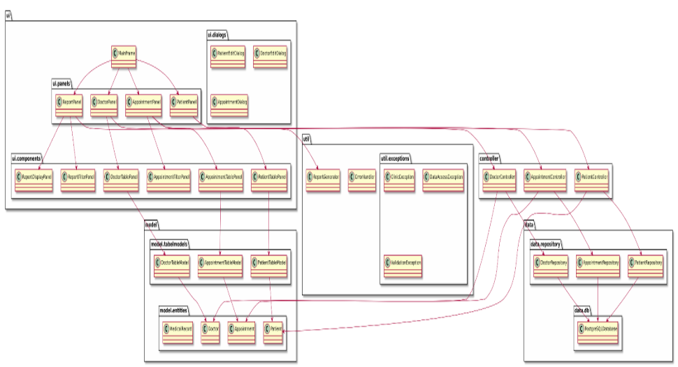

Рисунок 4.1 – Диаграмма архитектуры приложения

. 

**4.1 Пакет controller**

**4.1.1. Класс AppointmentController**

В таблице 4.1.1 представлена таблица спецификаций полей класса MainFrame.

Таблица 4.1.1 - Спецификации полей класса AppointmentController

|**№**|**Название переменной**|**Назначение переменной**|**Тип**|**Доступ**|
| :- | :- | :- | :- | :- |
|1|appointmentRepository|Репозиторий для доступа к данным о приёмах|AppointmentRepository|private|
|2|doctorController|Контроллер для работы с объектами Doctor|DoctorController|private|
|3|patientController|Контроллер для работы с объектами Patient|PatientController|private|

Таблица 4.1.2 - Спецификации переменных метода saveAppointment(Appointment appointment)

|**№**|**Название переменной**|**Назначение переменной**|**Тип**|**Доступ** |
| :- | :- | :- | :- | :- |
|1|appointment|Приём, подлежащий сохранению|Appointment|-|

Таблица 4.1.3 - Спецификации переменных метода updateAppointment(Appointment appointment)

|**№**|**Название переменной**|**Назначение переменной**|**Тип**|**Доступ** |
| :- | :- | :- | :- | :- |
|1|appointment|Приём, подлежащий обновлению|Appointment|-|

Таблица 4.1.4 - Спецификации переменных метода deleteAppointment(int id)

|**№**|**Название переменной**|**Назначение переменной**|**Тип**|**Доступ** |
| :- | :- | :- | :- | :- |
|1|id|Идентификатор для удаления|int|-|

Таблица 4.1.5 - Спецификации переменных метода getAvailableTimeSlots(Date date, int doctorId)

|**№**|**Название переменной**|**Назначение переменной**|**Тип**|**Доступ** |
| :- | :- | :- | :- | :- |
|1|date|Дата, для которой ищутся слоты|Date|-|
|2|doctorId|Идентификатор врача|int|-|
|3|availableSlots|Список доступных временных слотов|List<Date>|public|
|4|calendar|Календарь для генерации времён|Calendar|public|
|5|doctorAppointments|Список записей врача на день|List<Appointment>|public|
|6|busyTimes|Множество занятых времён|Set<Date>|public|
|7|appointment|Текущая запись из цикла|Appointment|public|
|8|timeSlot|Временной слот, проверяемый на занятость|Date|public|

Таблица 4.1.6 - Спецификации переменных метода getAppointmentsByDoctorAndPeriod(int doctorId, Date startDate, Date endDate)

|**№**|**Название переменной**|**Назначение переменной**|**Тип**|**Доступ** |
| :- | :- | :- | :- | :- |
|1|doctorId|ID врача|int|-|
|2|startDate|Начальная дата|Date|-|
|3|endDate|Конечная дата|Date|-|

Таблица 4.1.7 - Спецификации переменных метода updateAppointments(List<Appointment> appointments)

|**№**|**Название переменной**|**Назначение переменной**|**Тип**|**Доступ** |
| :- | :- | :- | :- | :- |
|1|appointments|Список приёмов, подлежащих обновлению|List<Appointment>|-|
|2|appointment|Элемент из списка|Appointment|-|

Таблица 4.1.8 - Спецификации переменных метода rescheduleAppointments(int doctorId, Date startDate, Date endDate, int offset)

|**№**|**Название переменной**|**Назначение переменной**|**Тип**|**Доступ** |
| :- | :- | :- | :- | :- |
|1|doctorId|ID врача|int|-|
|2|startDate|Начальная дата|Date|-|
|3|endDate|Конечная дата|Date|-|
|4|offset|Смещение в днях|int|-|
|5|appointments|Список найденных записей|List<Appointment>|public|
|6|calendar|Объект календаря для расчета новых дат|Calendar|public|
|7|appointment|Текущая запись, обрабатываемая в цикле|Appointment|public|
|8|newDate|Новая дата после смещения|Date|public|

Таблица 4.1.9 - Спецификации переменных метода getAppointmentsByPatient(int patientId)

|**№**|**Название переменной**|**Назначение переменной**|**Тип**|**Доступ** |
| :- | :- | :- | :- | :- |
|1|patientId|ID пациента|int|-|

Таблица 4.1.10 - Спецификации переменных метода validateAppointment(Appointment appointment)

|**№**|**Название переменной**|**Назначение переменной**|**Тип**|**Доступ** |
| :- | :- | :- | :- | :- |
|1|appointment|Приём, подлежащий валидации|Appointment|-|

**4.1.2. Класс DoctorController**

Таблица 4.1.11 – Спецификации полей класса **DoctorController**

|**№**|**Название переменной**|**Назначение переменной**|**Тип**|**Доступ**|
| :- | :- | :- | :- | :- |
|1|doctorRepository|Репозиторий для доступа к данным врачей|DoctorRepository|private|

Таблица 4.1.12 - Спецификации переменных метода getDoctorById(int id)

|**№**|**Название переменной**|**Назначение переменной**|**Тип**|**Доступ** |
| :- | :- | :- | :- | :- |
|1|id|Идентификатор врача|int|-|

Таблица 4.1.13 - Спецификации переменных метода saveDoctor(Doctor doctor)

|**№**|**Название переменной**|**Назначение переменной**|**Тип**|**Доступ** |
| :- | :- | :- | :- | :- |
|1|doctor|Объект врача для сохранения|Doctor|-|

Таблица 4.1.14 - Спецификации переменных метода updateDoctor(Doctor doctor)

|**№**|**Название переменной**|**Назначение переменной**|**Тип**|**Доступ** |
| :- | :- | :- | :- | :- |
|1|doctor|Объект врача для обновления|Doctor|-|

Таблица 4.1.15 - Спецификации переменных метода deleteDoctor(int id)

|**№**|**Название переменной**|**Назначение переменной**|**Тип**|**Доступ** |
| :- | :- | :- | :- | :- |
|1|id|Идентификатор врача для удаления|int|-|

Таблица 4.1.16 - Спецификации переменных метода validateDoctor(Doctor doctor)

|**№**|**Название переменной**|**Назначение переменной**|**Тип**|**Доступ** |
| :- | :- | :- | :- | :- |
|1|doctor|Объект врача, подлежащий валидации|Doctor|private|
|2|lastName|Фамилия врача|String|private|
|3|firstName|Имя врача|String|private|
|4|specialization|Специализация врача|String|private|
|5|phoneNumber|Телефон врача (проверка формата)|String|private|
|6|email|Электронная почта врача|String|private|

Таблица 4.1.17 - Спецификации переменных метода getDoctorByEmail(String email)

|**№**|**Название переменной**|**Назначение переменной**|**Тип**|**Доступ** |
| :- | :- | :- | :- | :- |
|1|email|Email, по которому производится поиск|String|-|

**

**4.1.3. Класс PatientController**

Таблица 4.1.18 – Спецификации полей класса **PatientController**

|**№**|**Название переменной**|**Назначение переменной**|**Тип**|**Доступ**|
| :- | :- | :- | :- | :- |
|1|patientRepository|Репозиторий для доступа к данным пациентов|PatientRepository|private|

Таблица 4.1.19 - Спецификации переменных метода getPatientById(int id)

|**№**|**Название переменной**|**Назначение переменной**|**Тип**|**Доступ** |
| :- | :- | :- | :- | :- |
|1|id|Идентификатор пациента|int|-|

Таблица 4.1.20 - Спецификации переменных метода savePatient(Patient patient)

|**№**|**Название переменной**|**Назначение переменной**|**Тип**|**Доступ** |
| :- | :- | :- | :- | :- |
|1|patient|Объект пациента для обновления|Patient|-|

Таблица 4.1.21 - Спецификации переменных метода deletePatient(int id)

|**№**|**Название переменной**|**Назначение переменной**|**Тип**|**Доступ** |
| :- | :- | :- | :- | :- |
|1|id|Идентификатор пациента для удаления|int|-|

Таблица 4.1.22 - Спецификации переменных метода validatePatient(Patient patient)

|**№**|**Название переменной**|**Назначение переменной**|**Тип**|**Доступ** |
| :- | :- | :- | :- | :- |
|1|patient|Объект пациента для валидации|Patient|-|
|2|lastName|Фамилия пациента|String|private|
|3|firstName|Имя пациента|String|private|
|4|phoneNumber|Телефон пациента|String|private|

Таблица 4.1.23 - Спецификации переменных метода getPatientByPhone(String phone)

|**№**|**Название переменной**|**Назначение переменной**|**Тип**|**Доступ** |
| :- | :- | :- | :- | :- |
|1|phone|Телефон пациента для поиска|String|-|

**4.2 Пакет util**

**4.2.1. Класс ErrorHandler**

В таблице 4.2.1 представлена таблица спецификаций полей класса ErrorHandler.

Таблица 4.2.1 - Спецификации переменных метода handleError(Throwable e)

|**№**|**Название переменной**|**Назначение переменной**|**Тип**|**Доступ** |
| :- | :- | :- | :- | :- |
|1|e|Объект исключения, переданный для обработки|Throwable|-|
|2|message|Текст сообщения, отображаемого пользователю|String|public|
|3|title|Заголовок окна с сообщением об ошибке|String|public|

**4.2.2. Класс ReportGenerator**

Таблица 4.2.2 – Спецификации полей класса DoctorController

|**№**|**Название переменной**|**Назначение переменной**|**Тип**|**Доступ**|
| :- | :- | :- | :- | :- |
|1|patientController|Контроллер для доступа к данным пациентов|PatientController|private|
|2|doctorController|Контроллер для доступа к данным врачей|DoctorController|private|
|3|appointmentController|Контроллер для доступа к данным записей на прием|AppointmentController|private|

Таблица 4.2.3 - Спецификации переменных метода generateClinicReport(Date startDate, Date endDate, Doctor doctor, Patient patient)

|**№**|**Название переменной**|**Назначение переменной**|**Тип**|**Доступ** |
| :- | :- | :- | :- | :- |
|1|startDate|Дата начала отчетного периода|Date|-|
|2|endDate|Дата окончания отчетного периода|Date||

Продолжение таблицы 4.2.3 - Спецификации переменных метода generateClinicReport(Date startDate, Date endDate, Doctor doctor, Patient patient)

|**№**|**Название переменной**|**Назначение переменной**|**Тип**|**Доступ** |
| :- | :- | :- | :- | :- |
|3|doctor|Врач, по которому фильтруется отчет (возможен null)|Doctor|-|
|4|patient|Пациент, по которому фильтруется отчет (возможен null)|Patient||
|5|reportContent|Объект для накопления текста отчета|StringBuilder||
|6|allAppointments|Список всех записей на прием с учетом примененных фильтров|List<Appointment>||
|7|patients|Список пациентов для вывода (всех или отфильтрованных)|List<Patient>||
|8|doctors|Список врачей для вывода (всех или отфильтрованных)|List<Doctor>||
|9|appointmentCount|Количество приемов для каждого врача/пациента|long||
|10|dateFormat|Форматтер для отображения даты и времени|SimpleDateFormat||
|11|appointmentPatient|Пациент, связанный с конкретной записью на прием|Patient||
|12|appointmentDoctor|Врач, связанный с конкретной записью на прием|Doctor||

Продолжение таблицы 4.2.3 - Спецификации переменных метода generateClinicReport(Date startDate, Date endDate, Doctor doctor, Patient patient)

|13|statusStats|Словарь со статистикой по статусам приемов (ключ — статус, значение — количество)|Map<String, Long>||
| :- | :- | :- | :- | :- |
**4.2.3. Класс ValidationUtils**

Таблица 4.2.4 – Спецификации полей класса **PatientController**

|**№**|**Название переменной**|**Назначение переменной**|**Тип**|**Доступ**|
| :- | :- | :- | :- | :- |
|1|EMAIL\_PATTERN|Регулярное выражение для проверки валидности email|Pattern|private|
|2|PHONE\_PATTERN|Регулярное выражение для проверки валидности телефона|Pattern|private|

Таблица 4.2.5 - Спецификации переменных метода isValidEmail(String email)

|**№**|**Название переменной**|**Назначение переменной**|**Тип**|**Доступ** |
| :- | :- | :- | :- | :- |
|1|email|Входящий параметр — email для валидации|String|-|

Таблица 4.2.6 - Спецификации переменных метода isValidPhone(String phone)

|**№**|**Название переменной**|**Назначение переменной**|**Тип**|**Доступ** |
| :- | :- | :- | :- | :- |
|1|phone|Входящий параметр — номер телефона для проверки|String|-|

Таблица 4.2.7 - Спецификации переменных метода isValidName(String name)

|**№**|**Название переменной**|**Назначение переменной**|**Тип**|**Доступ** |
| :- | :- | :- | :- | :- |
|1|name|Входящий параметр — имя для проверки|String|-|

Таблица 4.2.8 - Спецификации переменных метода isValidAddress(String address)

|**№**|**Название переменной**|**Назначение переменной**|**Тип**|**Доступ** |
| :- | :- | :- | :- | :- |
|1|address|Входящий параметр — адрес для проверки|String|-|

Таблица 4.2.9 - Спецификации переменных метода isValidProcedureType(String procedureType)

|**№**|**Название переменной**|**Назначение переменной**|**Тип**|**Доступ** |
| :- | :- | :- | :- | :- |
|1|procedureType|Входящий параметр — тип процедуры для проверки|String|-|

Таблица 4.2.9 - Спецификации переменных метода formatPhoneNumber(String phone)

|**№**|**Название переменной**|**Назначение переменной**|**Тип**|**Доступ** |
| :- | :- | :- | :- | :- |
|1|phone|Входящий параметр — номер телефона для форматирования|String|-|
|2|digits|Номер телефона с удалёнными нецифровыми символами|String|public|

Таблица 4.2.10 - Спецификации переменных метода isValidAppointmentTime(Date dateTime)

|**№**|**Название переменной**|**Назначение переменной**|**Тип**|**Доступ** |
| :- | :- | :- | :- | :- |
|1|dateTime|Входящий параметр — дата и время для проверки|Date|-|
|2|calendar|Объект календаря для извлечения часов и минут|Calendar|public|
|3|hour|Час из даты/времени|int|public|
|4|minute|Минута из даты/времени|int|public|

# **5 Проектирование тестов**

На основе функциональных требований были реализованы тесты, представленные в таблице 5.1.

Таблица 5.1 - Тестирование

|№|Входные данные|Выходные данные|
| :- | :- | :- |
|1|Добавление персонажа в список|В таблицу добавится персонаж с информацией, заполненной в появившемся окне|
|2|Отредактируем персонажа|В таблице изменятся данные о персонаже|
|3|Удалим персонажа из списка|Из таблицы удалится персонаж|
|4|Проверка на корректный ввод данных|Окно о неправильном вводе|
|5|Отфильтруем список записей по фамилии пациента|В таблице списка записей покажутся отсортированные по фамилии пациента записи |
|6|Отфильтруем список записей по дате|В таблице списка записей покажутся отсортированные по дате записи|
|7|Перенесем записи врача|В таблице списка записей покажутся сдвинутые по дате записи|
|8|Сгенерируем отчет|В текстовом поле панели управления отчетами появится отчет|
|9|Отфильтруем и сгенерируем отчет|В текстовом поле панели управления отчетами появится отфильтрованный отчет|
|10|Сохранение отчета в TXT|Отчет будет сохранен в TXT-файл|

# **6 Результаты тестирования**

На рисунках 6.1-6.14 представлены результаты тестирования.

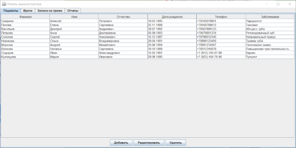

Рисунок 6.1 – Список пациентов до добавления (тест 1)

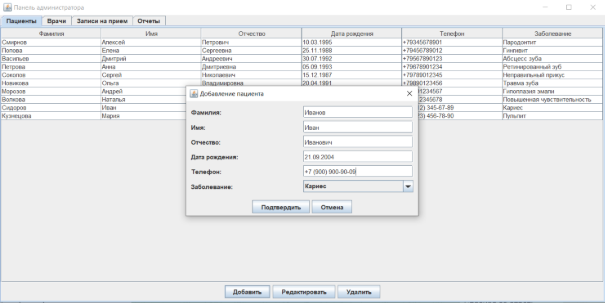

Рисунок 6.2 – Добавление пациента (тест 1)

![ref3]

Рисунок 6.3 – Список пациентов после добавления (тест 1)

![ref3]

Рисунок 6.3 – Список пациентов до редактирования (тест 2)

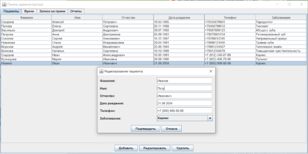

Рисунок 6.4 – Редактирование пациента (тест 2)

![ref4]

Рисунок 6.5 – Список пациентов после редактирования (тест 2)

![ref4]

Рисунок 6.6 –Список пациентов до удаления (тест 3)

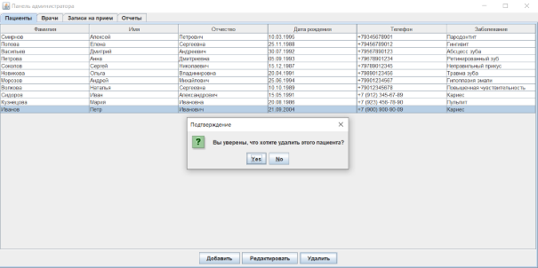

Рисунок 6.7 – Удаление пациента (тест 3)

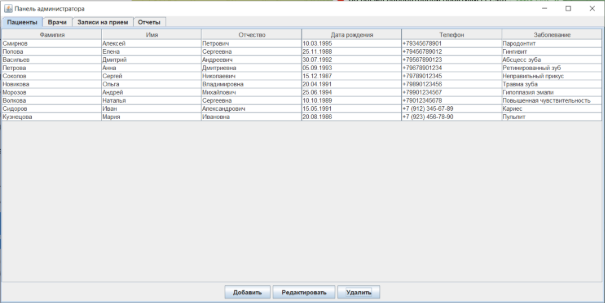

Рисунок 6.8 – Список пациентов после удаления (тест 3)

Рисунок 6.9 – Неправильное заполнение информации (тест 4)

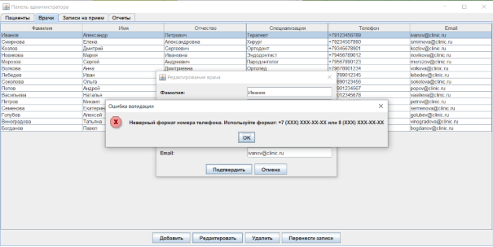

Рисунок 6.10 – Предупреждение о неправильном вводе (тест 4)

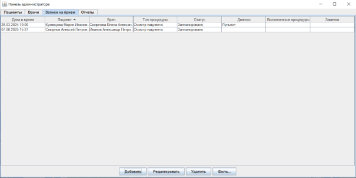

Рисунок 6.11 – Фильтрация записей по возрастанию порядкового номера буквы фамилии пациента (тест 5)

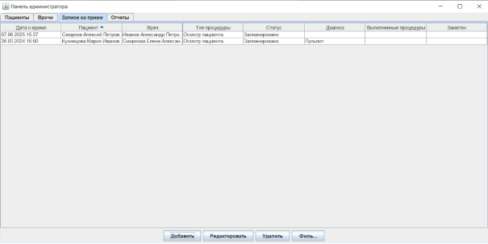

Рисунок 6.12 – Фильтрация записей по убыванию порядкового номера буквы фамилии пациента (тест 5)

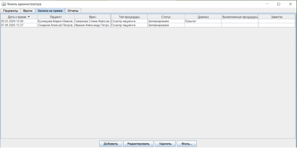

Рисунок 6.13 – Фильтрация записей по возрастанию новизны записей (тест 6)

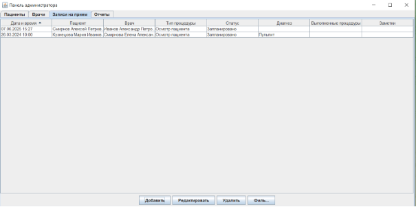

Рисунок 6.14 – Фильтрация записей по убыванию новизны записей (тест 6)

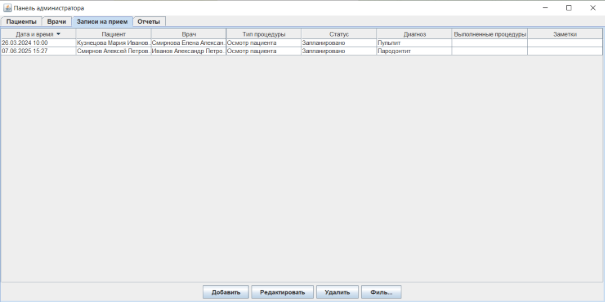

Рисунок 6.15 – Список записей до переноса (тест 7)

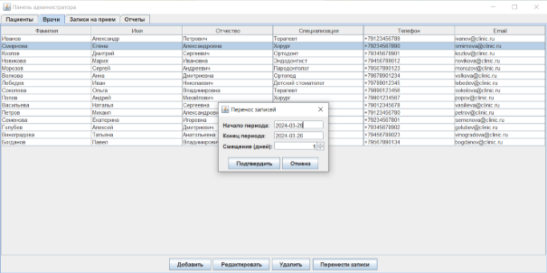

Рисунок 6.16 – Перенос записей врача (тест 7)

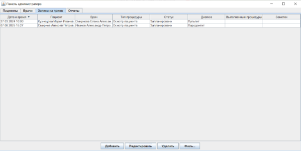

Рисунок 6.17 – Список записей после переноса (тест 7)

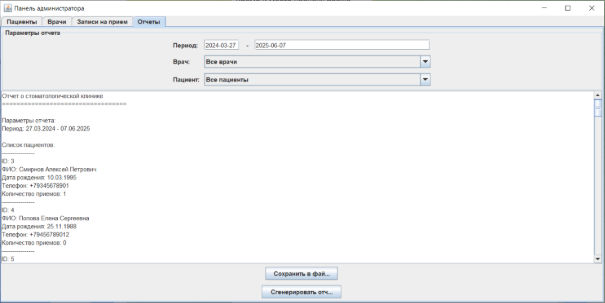

Рисунок 6.18 – Сгенерированный отчет (тест 8)

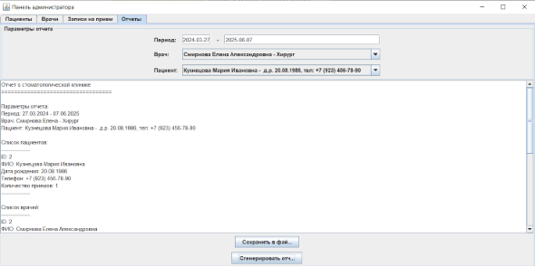

Рисунок 6.19 – Сгенерированный отчет с фильтрацией (тест 9)

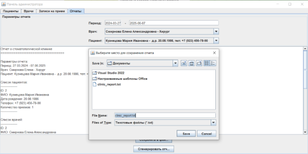

Рисунок 6.20 – Сохранение отчета в файл (тест 10)

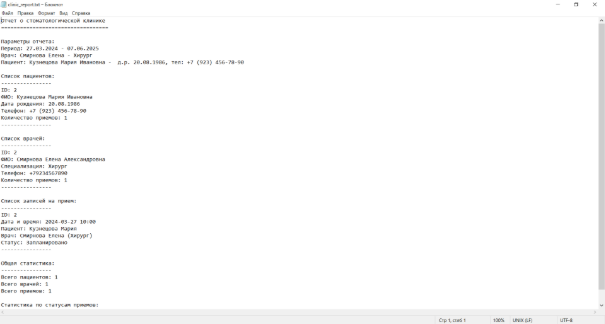

Рисунок 6.21 – Сохранившийся в файл отчет (тест 10)

# **7 Исходный код**

Исходный код опубликован на платформе GitHub. Для просмотра исходного кода необходимо перейти по ссылке: https://github.com/Ilyouha852/kursach

# **Заключение**

В ходе выполнения курсового проекта разработана программа "Стоматологическая клиника" для автоматизации рутинных процессов работы стоматологической клиники. Приложение создано на языке Java с использованием инструментов разработки, включая IntelliJ IDEA, Visual Studio Code, библиотек Swing и AWT для графического интерфейса, а также PostgreSQL для хранения данных. В процессе работы создано приложение с графическим интерфейсом, включающим панели управления пациентами, врачами, записями на прием, отчетами.

В проекте были применены принципы объектно-ориентированного программирования, реализована работа с базой данных через PostgreSQL, что обеспечивает хранение и доступ к информации об пациентах, врачах, записях на прием, разработан механизм экспорта отчетности в TXT, что делает программу готовой к практическому использованию в реальных условиях.

Также в рамках проекта были реализованы все основные функциональные требования:

- Хранение информации о пациентах
- Операции с пациентами:
  - Регистрация нового пациента.
  - Редактирование данных пациента.
  - Удаление пациента из системы.
  - Просмотр полной медицинской истории.
- Хранение информации о врачах:
- Операции с врачами:
  - Добавление нового врача.
  - Редактирование данных врача.
  - Удаление врача из системы.
  - Просмотр расписания врача.
  - Создание и управление записями.
- Генерация отчетов.
- Экспорт отчетов.
- Работа с базой данных.

Все поставленные задачи выполнены, цель работы достигнута.

# **Список использованных источников**

1. Фримен Э. Head First. Паттерны проектирования. Обновленное юбилейное издание. – СПб.: Питер, 2018. – 656 с. 
1. ` `Аршинский В.Л. Объектно-ориентированное программирование. Методические указания по курсовому проекту. — Иркутск: Изд-во ИРНИТУ, 2018. — 13 с.
1. Эккель Б. Философия Java. 4-е полное изд. — СПб.: Питер, 2018. — 1168 с.

[ref1]: Aspose.Words.aa480bab-2396-4c56-82c0-21e270a5f973.006.png
[ref2]: Aspose.Words.aa480bab-2396-4c56-82c0-21e270a5f973.009.png
[ref3]: Aspose.Words.aa480bab-2396-4c56-82c0-21e270a5f973.014.png
[ref4]: Aspose.Words.aa480bab-2396-4c56-82c0-21e270a5f973.016.png
